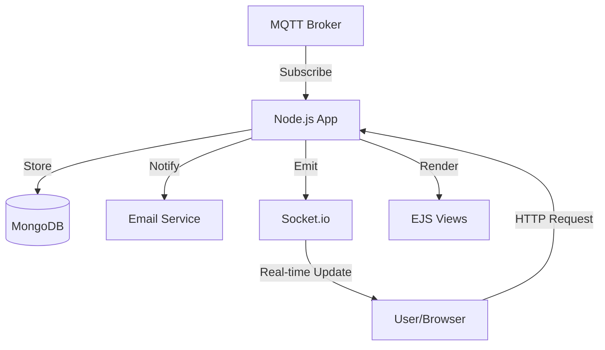

# Project Analysis: LoRaWAN Gate Monitoring

## 1. Project Overview
**Name**: `lorawan-gate-monitoring`
**Purpose**: A system to monitor the status of physical gates (open/closed) using LoRaWAN devices. It ingests data via MQTT, stores it in MongoDB, and provides a real-time web dashboard for visualization and management.
**Technologies**:
- **Runtime**: Node.js (ES Modules)
- **Web Framework**: Express.js
- **Database**: MongoDB (via Mongoose)
- **Templating**: EJS
- **Protocols**: MQTT (Ingestion), WebSocket (Socket.io for Real-time updates)
- **Process Management**: PM2

## 2. Architecture

The application follows a Model-View-Controller (MVC) pattern.

### Core Components

#### A. Entry Point & Configuration
- **`src/app.js`**: Bootstrapper that initializes the Database connection and then starts the Server.
- **`src/config/server.js`**: Configures the Express app, middleware (CORS, JSON, Static files), and attaches `socket.io`.
- **`src/config/connect-db.js`**: Handles MongoDB connection.

#### B. Data Ingestion (The Core Logic)
- **`src/utils/mqtt.js`**: An MQTT client that connects to a broker and listens for messages on a configured topic.
- **`src/controllers/mqttMessageReciver.js`**: Processing logic for incoming messages:
    1.  **Parsing**: Normalizes timestamp formats.
    2.  **Enrichment**: Lookout for device description using `deviceDao`.
    3.  **Logic**: Checks if the gate state changed (Open vs Closed).
    4.  **Notification**: Sends an email via `nodemailer` if the state changed.
    5.  **Persistence**: Saves the data point using `dataDao`.
    6.  **Real-time**: Emits a `dashboard:update` event to connected clients.

#### C. Database Layer
- **DAOs (`src/daos`)**: Abstraction layer for database operations.
    - `deviceDao`: Manages device registry (CRUD).
    - `dataDao`: Manages historical sensor data.
- **Models (`src/models`)**: Mongoose schemas.
    - `deviceSchema`: `{ deveui, description }`
    - `dataSchema`: Sensor readings.

#### D. Web Interface
- **Routes (`src/routes`)**:
    - `/`: Main dashboard. Renders `index` view with history and logs.
    - `/devices`: Device management. Renders `devices` view.
- **Views (`src/views`)**: Server-side rendered EJS templates.
    - `index.ejs`: Dashboard showing live status and history tables.
    - `devices.ejs`: Interface to Add/Edit/Delete devices.
- **Public Assets (`src/public`)**: CSS, JS, and images.

## 3. Key Features

### Device Management
- Full CRUD (Create, Read, Update, Delete) capability for LoRaWAN devices.
- Devices are identified by `deveui`.

### Real-time Monitoring
- The dashboard updates automatically when new MQTT messages arrive, thanks to Socket.io.
- Users can see the current state (Open/Closed), battery level, and signal strength (RSSI/SNR).

### Notifications
- Automated email alerts are sent when a gate changes state (e.g., from Closed to Open).

## 4. Deployment
- configured with `pm2.json` for production deployment.
- Supports SSL/TLS via `certificates` directory (configurable via `.env`).

## 5. Potential Improvements (Observations)
- **Validation**: Input validation in controllers could be more robust (using a library like `joi` or `express-validator`).
- **Error Handling**: While there is a global error handler, some async errors might need consistent catching in wrappers.
- **Frontend State**: The frontend relies on reload/socket events. Implementing a client-side store or using a framework (React/Vue) could enhance interactivity, though EJS is efficient for this scale.
